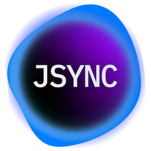

#  JSYNC Backup

A macOS AppleScript application that automates rsync backups for Capture One sessions.

## Features

- Automated rsync backups of active Capture One sessions
- Real-time progress notifications with file counts and transfer speeds
- Remembers backup locations for convenience
- Handles errors like disk space issues gracefully
- Automatically detects the current Capture One session folder

## Installation

### Download Release (Recommended)
1. Go to [Releases](https://github.com/jessemorley/jsync/releases)
2. Download the latest `JSYNC-Backup-vX.X.X.zip`
3. Unzip the archive
4. **Move `JSYNC Backup.scptd` to `~/Library/Scripts/Capture One Scripts/`**
5. The script will appear in Capture One's **Scripts** menu

## Usage

1. Open Capture One with a session loaded
2. Go to Scripts menu → JSYNC Backup
3. Choose an action:
   - Run Backup: Use saved location or select new one
   - Choose Location: Browse for backup destination
   - Cancel: Exit without backing up
4. Monitor progress via system notifications
5. Completion notification shows transfer summary

## Requirements

- macOS 10.14 or later
- Capture One (any recent version)
- rsync (included with macOS)

## How it works

1. Detects the active Capture One session folder
2. Scans files to estimate total count for progress tracking
3. Runs rsync in the background with progress monitoring
4. Shows periodic notifications with current status
5. Displays final summary with transfer statistics

## File locations

- Backup preferences: `~/Library/Application Support/CaptureOneBackup/`
- Temporary files: System temp directory (automatically cleaned up)

## License

Copyright © 2024 Jesse Morley. All rights reserved.